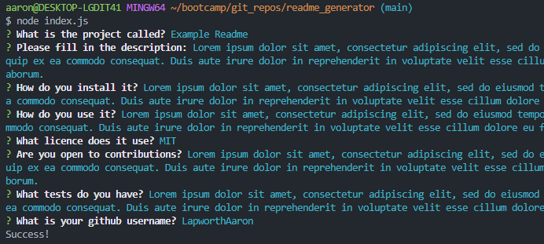

# readme_generator
bootcamp Week 11 assignment

## Description

 
The task was to create a readme markdown generator using javscript and node.js. The task is to allow users to quickly create a professional README for a new project.
Some of the acceptance criteria for this project:

* Create a command-line application that accepts user input.
  * When a user is prompted for information about the application repository then a high-quality, professional README.md is generated with:
    * The title of my project 
    * Sections entitled:
      * Description 
      * Table of Contents 
      * Installation 
      * Usage 
      * License 
      * Contributing 
      * Tests 
      * Questions
    * When a user enters the project title then it is displayed as the title of the README
    * When a user enters a description, installation instructions, usage information, contribution guidelines, and test instructions then this information is added to the sections of the README entitled Description, Installation, Usage, Contributing, and Tests
    * When a user chooses a license for their application from a list of options then a badge for that license is added near the top of the README and a notice is added to the section of the README entitled **License** that explains which license the application is covered under
    * When a user enters their GitHub username then this is added to the section of the README entitled Questions, with a link to their GitHub profile
    * When a user enters their email address then this is added to the section of the README entitled Questions, with instructions on how to reach them with additional questions
    * When a user clicks on the links in the **Table of Contents** then they are taken to the corresponding section of the README

Website: n/a
 Repository: https://github.com/LapworthAaron/readme_generator

In this project i have learnt how to use node.js further, while also learning fs, module exports and the npm package inquirer.

## Table of Contents (Optional)

- [Installation](#installation)
- [Usage](#usage)
- [Credits](#credits)
- [License](#license)

## Installation

Install folder structure as is, into a root directory.
Then follow the install requirements in the package.json
* you will need to install inquirer v8.0.0 using npm (npm install --save @8.0.0)

## Usage

Run the file using: node index.js
When prompted fill in the answers to the questions displayed
The readme file will be outputted to your working root directory, with the project title suffixed onto the filename.

## Credits

© 2023 Aaron Lapworth. Confidential and Proprietary. All Rights Reserved.

## License

MIT License

Copyright (c) 2023 Aaron Lapworth

Permission is hereby granted, free of charge, to any person obtaining a copy
of this software and associated documentation files (the "Software"), to deal
in the Software without restriction, including without limitation the rights
to use, copy, modify, merge, publish, distribute, sublicense, and/or sell
copies of the Software, and to permit persons to whom the Software is
furnished to do so, subject to the following conditions:

The above copyright notice and this permission notice shall be included in all
copies or substantial portions of the Software.

THE SOFTWARE IS PROVIDED "AS IS", WITHOUT WARRANTY OF ANY KIND, EXPRESS OR
IMPLIED, INCLUDING BUT NOT LIMITED TO THE WARRANTIES OF MERCHANTABILITY,
FITNESS FOR A PARTICULAR PURPOSE AND NONINFRINGEMENT. IN NO EVENT SHALL THE
AUTHORS OR COPYRIGHT HOLDERS BE LIABLE FOR ANY CLAIM, DAMAGES OR OTHER
LIABILITY, WHETHER IN AN ACTION OF CONTRACT, TORT OR OTHERWISE, ARISING FROM,
OUT OF OR IN CONNECTION WITH THE SOFTWARE OR THE USE OR OTHER DEALINGS IN THE
SOFTWARE.